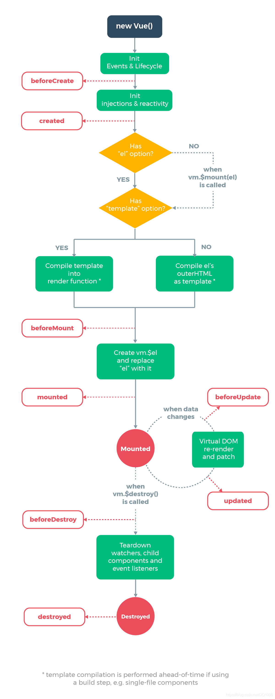

# 语法初探

## lesson_01 组件的基础概念
- 浏览 console 中修改Vue变量：<br>
  vm.$data.message = "你好世界"  or vm.message = "你好"

## lesson_02 (Vue生命周期函数)

1. 生命周期函数：在某一时刻会自动执行的函数
2. 详见代码示例

## lesson_03 (常用模板语法)
- v-html 以 html 的形式展示模板 （详见示例）
    ```js
    app = Vue.createApp({
        data() {
            return {
                message: "<strong>hello world</strong>"
            }
        },
        template: `<div v-html="message"></div>`
    });
    ```
- v-bind 双向绑定 ("v-bind:" 可简写 ":")
    ```js
    app = Vue.createApp({
        data() {
            return {
                message: "hello world"
            }
        },
        template: `<div v-bind:title="message">Test</div>`
    });
  
    app = Vue.createApp({
        data() {
            return {
                disable: false  // true of false
            }
        },
        template: `<input v-bind:disabled="disabled"/>`
    });
    ```
- v-once 变量只使用一次
  ```js
  app = Vue.createApp({
        data() {
            return {
                message: "hello world"
            }
        },
        template: `<div v-once>{{message}}</div>`
    });
  ```
- v-if  判断
  ```js
  app = Vue.createApp({
        data() {
            return {
                show: false  // true of false
            }
        },
        template: `<div v-if="show">Hello</div>`
    });
  ```
- v-on 事件绑定 （"v-on:" 简写 "@"）
  ```js
  app = Vue.createApp({
        data() {
            return {
                message: "hello world",
                event: "mouseenter",
                divAttr: "title1"
            }
        },
        methods: {
            handleClick(){
                alert("click")
            }
        },
        // template: `<div v-on:click="handleClick">Hello</div>`
        // template: `<div @click="handleClick">Hello</div>`  // "v-on:" 简写 "@"
        template: `<div @[event]="handleClick" :[divAttr]="message">Hello</div>`   // 动态属性  "v-bind:" 可简写 ":"
    });
  ```

- 阻止默认行为 e.preventDefault() 和 @click.prevent
  ```js
  app = Vue.createApp({
        methods: {
            handleClick(e){
                e.preventDefault()
            },
            handleClick1(){
            }
        },
        // 方法一：通过 e.preventDefault() 实现阻止默认行为
        /*template: `
          <div>
            <form action="https://www.baidu.com" @click="handleClick">
              <button type="submit">提交</button>
            </form>
          </div>
        `,*/
        // 方法一：通过 @click.prevent="handleClick1" 实现阻止默认行为
        template: `
          <div>
            <!-- <form action="https://www.baidu.com">-->
            <form action="https://www.baidu.com" @click.prevent="handleClick1">
              <button type="submit">提交</button>
            </form>
          </div>
        `
    });
  ```

## lesson_04 (计算属性 computed)
- 当计算属性依赖的内容发生变更时，才会重新执行计算
  ```js
  app = Vue.createApp({
        data() {
            return {
                count: 2,
                price: 10,
            }
        },
        // 当计算属性依赖的内容发生变更时，才会重新执行计算
        computed: {
            total() {
                return this.count * this.price
            }
        },
        template: `<div>{{total}}</div>`
    });
  ```
## lesson_05 (侦听属性 watch)
- 当侦听属性发生变化时，函数会被执行
  ```js
  app = Vue.createApp({
        data() {
            return {
                count: 2,
                price: 10,
            }
        },
        watch: {
            // 当price发生变化时，函数会被执行
            price(current, prev){
                console.log("current, prev: ", current, prev)
                this.newTotal = current * this.count
                setTimeout(() => {
                    console.log("price changed before 3s")
                }, 3000)
            }
        },

        // 当计算属性依赖的内容发生变更时，才会重新执行计算
        computed: {
            total() {
                return this.count * this.price
            }
        },
        template: `<div>{{total}}---{{newTotal}}</div>`
    });
  ```

## lesson_06 样式

- 绑定样式的几种方法
  ```js
      app = Vue.createApp({
        data() {
            return {
                classString: "green",
                classObject: {red: true, green: false},
                // classArray: ["green", "red", {brown: true}],
                classArray: ["red", "green"],
                styleString: "color: yellow",  // 行内样式 原生语法
                styleObject: {                 // 行内样式 Vue语法
                    "color": "orange"
                } 
            }
        },
        // template: `<div class="green">Hello World</div>`
        // template: `<div :class="classString">Hello World</div>`   // vm.classString = "red"
        // template: `<div :class="classObject">Hello World</div>`   // vm.classObject.green = false
        // template: `<div :class="classArray">Hello World</div>`       // vm.classArray = ["red"]
        template: `
          <div :style="styleString"> styleString </div>
          <div :style="styleObject"> styleObject </div>
          <div :class="classArray">
            Hello World
          <demo :class="classString"
            :subClassObject="classObject"
          />
          </div>`
    });

    // :class="$attrs.class" 表示使用父组件的class属性
    app.component("demo", {
        props: ["subClassObject"],
        template: `
          <div :class="$attrs.class">one</div>
          <div :class="subClassObject">two</div>
        `
    })
  ```

## lesson_07 条件渲染
- v-if="show" 和 v-show="show" 的区别
- v-if="show" 会移除dom，到达不渲染效果
- v-show="show" 通过 style="display: none;"，到达不渲染效果
- v-if v-else-if v-else 的使用
  ```js
  app = Vue.createApp({
  data() {
    return {
      show: false,
      conditionOne: false,
      conditionTwo: false
    }
  },
  // v-if="show" 和 v-show="show" 的区别
  // 1. v-if="show" 会移除dom，到达不渲染效果
  // 2. v-show="show" 通过 style="display: none;"，到达不渲染效果
  template: `

        <div v-if="conditionOne">if</div>
        <div v-else-if="conditionTwo">elif</div>
        <div v-else>else</div>


        <div v-if="show">Hello World</div>
        <div v-show="show">Bey World</div>
        `
  })
  ```

## lesson_08 列表循环渲染

- 遍历数据
- 遍历对象
- 通过 ":key=" 优化性能
- 变更列表中的值
- v-for 和 v-if 结合使用时，外层使用 template占位标签，可去除外出多余的 div 标签
  ```js
  app = Vue.createApp({
        data() {
            return {
                arrayList: ["aaa", "ddd", "bbb", "ccc"],
                objectObj: {
                    firstName: "Guo",
                    secondName: "Wei",
                    job: "playGame"
                }
            }
        },
        methods: {
            clickHandle() {
                // 1. 使用数组的变更函数：push pop shift unshift reverse sort
                // this.arrayList.push("Hello")
                // this.arrayList.pop()
                // this.arrayList.reverse()
                // this.arrayList.sort()
                // this.arrayList.shift()
                // this.arrayList.unshift("World")

                // 2. 直接替换数组
                // this.arrayList = ["bey", "world"]
                // this.arrayList = ["bey", "world"].filter(item => item !== "bey")

                // 3. 直接更新数组内容
                // this.arrayList[1] = "update"

                // 4. 直接添加对象的内容，也可以自动的展示出来
                this.objectObj.age = 100
            }
        },
        template: `
          <div> ------示例：v-for="(item, index) in arrayList"------</div>
              <div v-for="(item, index) in arrayList" :key="index">
              <div>{{item}}----{{index}}</div>
          </div>
          <button @click="clickHandle"> 增加</button>

          <div> ------示例：v-for="(val, key, index) in objectObj"------</div>
          <div v-for="(val, key, index) in objectObj">
            <div>{{val}} -- {{key}} -- {{index}}</div>
          </div>

          <div> ------示例：v-for="item in 10"------</div>
          <div v-for="item in 10">{{item}}</div>

          <div> ------示例：v-for 和 v-if 结合使用时，外层使用 template占位标签，可去除外出多余的 div 标签------</div>
          <template v-for="(val, key, index) in objectObj">
            <div v-if="key != 'secondName'">{{val}} -- {{key}} -- {{index}}</div>
          </template>
        `
    })
  ```


## lesson_09 事件绑定
1. 事件函数可以直接写到模板中
2. 模板调用事件函数不传参数时，默认会传递 event
3. 模板调用函数传参数时，如果需要传递 event时，模板中需要传递 "$event" 参数
4. 同时绑定多个函数到事件, 模板中函数必须加 ()
5. 事件修饰符
   - stop(停止事件冒泡)
   - self(事件只用作用于自己)
   - prevent(阻止默认行为)
   - capture(捕获事件)
   - once(事件只执行一次)
   - scroll.passive (提升滚动性能)
  ```js
  app = Vue.createApp({
      data() {
          return {
              counter: 0
          }
      },
      methods: {
          // 1. 事件函数可以直接写到模板中
          // <button @click="counter += 1"> 增加</button>
  
          // 2. 模板调用事件函数不传参数时，默认会传递 event
          /*clickHandle(event) {
              console.log(event.target)
              this.counter += 1
          }*/
          // <button @click="clickHandle"> 增加</button>
  
          // 3. 模板调用函数传参数时，如果需要传递 event时，模板中需要传递 "$event" 参数
          /*clickHandle(num, event) {
              console.log(event.target)
              this.counter += num
          }*/
          // <button @click="clickHandle(2, $event)"> 增加</button>
  
          // 4. 同时绑定多个函数到事件, 模板中函数必须加 ()
          /*clickHandle(num, event) {
              alert(1)
          },
          clickHandle1(num, event) {
              alert(2)
          }*/
          // <button @click="clickHandle(), clickHandle1()"> 增加</button>
  
          // 5. 事件修饰符
          // stop(停止事件冒泡)
          // self(事件只用作用于自己)
          // prevent(阻止默认行为)
          // capture(捕获事件)
          // once(事件只执行一次)
          // scroll.passive (提升滚动性能)
        
          clickHandle() {
              alert(1)
          },
          clickHandle1() {
              this.counter += 1
          }
      },
      template: `
        <div >
  <!--          {{counter}}-->
  <!--          <button @click="counter += 1"> 增加</button>-->
  <!--          <button @click="clickHandle"> 增加</button>-->
  <!--          <button @click="clickHandle(2, $event)"> 增加</button>-->
  <!--          <button @click="clickHandle(), clickHandle1()"> 增加</button>-->
  
  <!--          <div @click.self="clickHandle">-->
  <!--          <div @click.once="clickHandle">-->
  <!--          <div @click.prevent="clickHandle">-->
        <div @click.capture="clickHandle">
          {{counter}}
  <!--            <button @click.stop="clickHandle1"> 增加</button>-->
          <button @click="clickHandle1"> 增加</button>
        </div>
        </div>
  
      `
  })
  ```

6. 按键修饰符：enter, tab, delete, esc, up, down, left, right
7. 鼠标修饰符：left, right, middle
8. 精确修饰符：exact
  ```js
  app = Vue.createApp({
      methods: {
          // 6. 按键修饰符：enter, tab, delete, esc, up, down, left, right
          /*clickHandle(event) {
              console.log("keydown: ", event.keyCode)
          },*/
          // <input @keydown.enter="clickHandle"/>
  
          // 7. 鼠标修饰符：left, right, middle
          /*clickHandle(event) {
              console.log("click right")
          },*/
          //  <div  @click.right="clickHandle">鼠标修饰符测试</div>
  
          // 8. 精确修饰符：exact
          clickHandle() {
              console.log("left + click")
          }
          // <div  @click.left.exact="clickHandle">left+鼠标</div>
      },
      template: `
        <div >
        <div  @click.left.exact="clickHandle">left+鼠标</div>
        </div>
  
      `
  })
  ```
## lesson_09 双向绑定
1. input 框双向绑定
2. textarea 框双向绑定
3. checkbox 框双向绑定
   - 使用 false-value="hello" true-value="world"
4. radio 框双向绑定
5. select 框双向绑定
6. v-model 修饰符
   - lazy 输入完成后双向绑定触发  <input v-model.lazy="message">
   - number 输入数据转换成数字绑定  <input v-model.number="message" type="number" >
   - trim 去除输入前后空格进行绑定  <input v-model.trim="message" >
```js
  // 1. input 框双向绑定
  // <input v-model="message"/>

  // 2. textarea 框双向绑定
  // <textarea v-model="message"/>

  // 3. checkbox 框双向绑定
  /*app = Vue.createApp({
      data() {
          return {
              message: []
          }
      },
      template: `

      <div>
        {{message}} <br>
        jack <input type="checkbox" v-model="message" value="jack" \> <br>
        rose <input type="checkbox" v-model="message" value="rose" \> <br>
        tudou <input type="checkbox" v-model="message" value="tudou" \> <br>
      </div>
      `
  })*/
  // 使用 false-value="hello" true-value="world"
  /*app = Vue.createApp({
      data() {
          return {
              message: "hello"
          }
      },
      template: `
      {{message}}
      <div>
        <input type="checkbox" v-model="message" false-value="hello" true-value="world"\>
      </div>
      `
  })*/

  // 4. radio 框双向绑定
  /*app = Vue.createApp({
      data() {
          return {
              message: ""
          }
      },
      template: `

      <div>
        {{message}} <br>
        jack <input type="radio" v-model="message" value="jack" \> <br>
        rose <input type="radio" v-model="message" value="rose" \> <br>
        tudou <input type="radio" v-model="message" value="tudou" \> <br>
      </div>
      `
  })*/

  // 5. select 框双向绑定
  // 5.1 单选
  /*app = Vue.createApp({
      data() {
          return {
              message: ""
              }
      },
      template: `

      <div>
        {{message}} <br>
        <select v-model="message">
          <option disabled value="">请选择</option>
          <option value="AA">A</option>
          <option value="BB">B</option>
          <option value="CC">C</option>
        </select>
      </div>
      `
  })*/

  // 5.2 多选
  /*app = Vue.createApp({
      data() {
          return {
              message: ""
          }
      },
      template: `

      <div>
        {{message}} <br>
        <select v-model="message" multiple>
          <option value="AA">A</option>
          <option value="BB">B</option>
          <option value="CC">C</option>
        </select>
      </div>
      `
  })*/
  // ------------------- 优化后--------------------------
  /*app = Vue.createApp({
      data() {
          return {
              message: "",
              options: [
                  {text: "A", value: "AAAAA"},
                  {text: "B", value: "BBBBB"},
                  {text: "C", value: "CCCCC"},
              ]
          }
      },
      template: `

      <div>
        {{message}} <br>
        <select v-model="message" multiple>
          <option v-for="item in options" :value="item.value">{{item.text}}</option>
        </select>
      </div>
      `
  })*/

  // 6. v-model 修饰符
  // lazy 输入完成后双向绑定触发  <input v-model.lazy="message">
  // number 输入数据转换成数字绑定  <input v-model.number="message" type="number" >
  // trim 去除输入前后空格进行绑定  <input v-model.trim="message" >
  app = Vue.createApp({
      data() {
          return {
              message: "123"
          }
      },
      template: `
      {{message}}
      <div>
        <input v-model.trim="message" \>
      </div>
      `
  })
```
